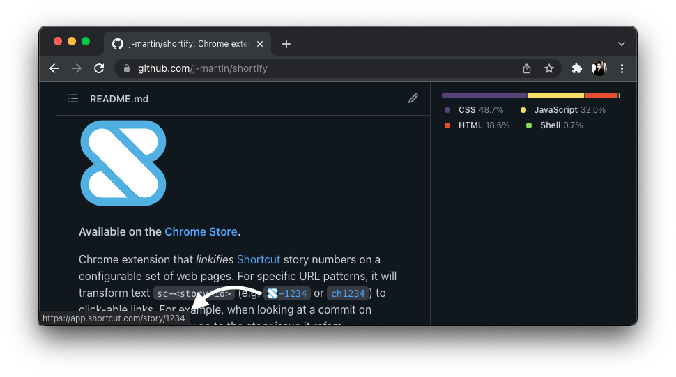

Clubify
======

**Available on the [Chrome Store](https://chrome.google.com/webstore/detail/goephcddocajoogjiddapcddobhlgglb).**

Chrome extension that _linkifies_ [Clubhouse](https://clubhouse.io) story numbers on a configurable set of
web pages. For specific URL patterns, it will transform text `ch<story-id>` (e.g. `ch1234`) to
click-able links. For example, when looking at a commit on GitHub you can quickly
go to the story issue it refers.

See the [Clubhouse documentation](https://help.clubhouse.io/hc/en-us/articles/207540323-Using-the-Clubhouse-GitHub-Integration-with-Branches-and-Pull-Requests)
for more information about the story naming convention.

This is modified fork of [JIRAfy](https://github.com/square/jirafy). Hence the name.

Developing
----------

Follow these steps if you are tweaking the clubify code and want to quickly see
your changes reflected in the browser:

 * Clone this repository.
 * Go to Chrome's Extensions area and make sure "Developer Mode" is checked.
 * Click the "Load unpacked extension..." button and then choose this repo's folder.
 * Click the "Options" link to configure the extension.

License
-------

    Copyright 2013 Square, Inc., 2018 Jean-Martin Archer

    Licensed under the Apache License, Version 2.0 (the "License");
    you may not use this file except in compliance with the License.
    You may obtain a copy of the License at

       http://www.apache.org/licenses/LICENSE-2.0

    Unless required by applicable law or agreed to in writing, software
    distributed under the License is distributed on an "AS IS" BASIS,
    WITHOUT WARRANTIES OR CONDITIONS OF ANY KIND, either express or implied.
    See the License for the specific language governing permissions and
    limitations under the License.
